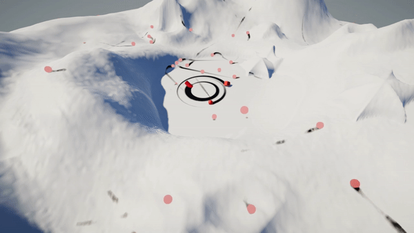

# MA_Toolbox - MA_HeightMapCaptureRig

**For learning purposes only.**

- Using Graphics.Blit instead of compute might be better/faster?
- One of the two extra cameras could be removed to increase performance?
  - But the terrain itself would need a double sided material?

A tool that calculates a height map texture with terrain - object intersection.

- Realtime height map generation.
  - Compute shading.
- Terrain - object interaction.
- (Snow) height recovery.

## Install

[Installing from a Git URL](https://docs.unity3d.com/Manual/upm-ui-giturl.html)

## LICENSE

Overall package is licensed under [MIT](/LICENSE.md), unless otherwise noted in the [3rd party licenses](/THIRD%20PARTY%20NOTICES.md) file and/or source code.
